# qbpm

qbitOS node process manager — spatial graph UI, **JSON across**, **Python/JAX up**, **CUDA/C++ down**.

Not ComfyUI. Local app for graph orchestration; Colossus configs stay portable in `configs/colossus.yaml`.

## Stack

| Layer | Path |
|---|---|
| Graph UI | `web/` — canvas node editor |
| API / runtime | `src/qbpm/` — FastAPI + graph engine |
| JSON graphs | `graphs/*.json` + `schemas/graph.schema.json` |
| CUDA stubs | `src/kernels/*.cu` |
| Cluster port | `configs/colossus.yaml` |
| Tools | `tools/` — e.g. `tools/kbatch/` (live keyboard analyzer) |

## Start

```bash
cd /Volumes/qbitOS/00.dev/projects/qbpm
chmod +x start.sh
./start.sh
```

Open **http://127.0.0.1:8796** · static shell at **https://qbitos.github.io/qbpm/** · **https://fornevercollective.github.io/Qbpm/** · full stack at **https://qbitos.ai**

## Screenshots

### Workspace

| Graph canvas + dock rail | All float panels open |
|---|---|
| 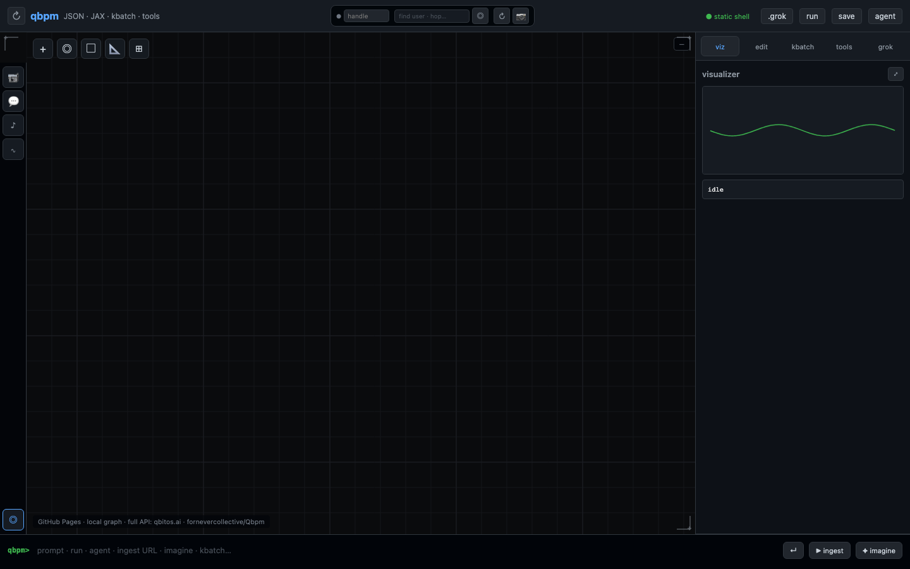 | 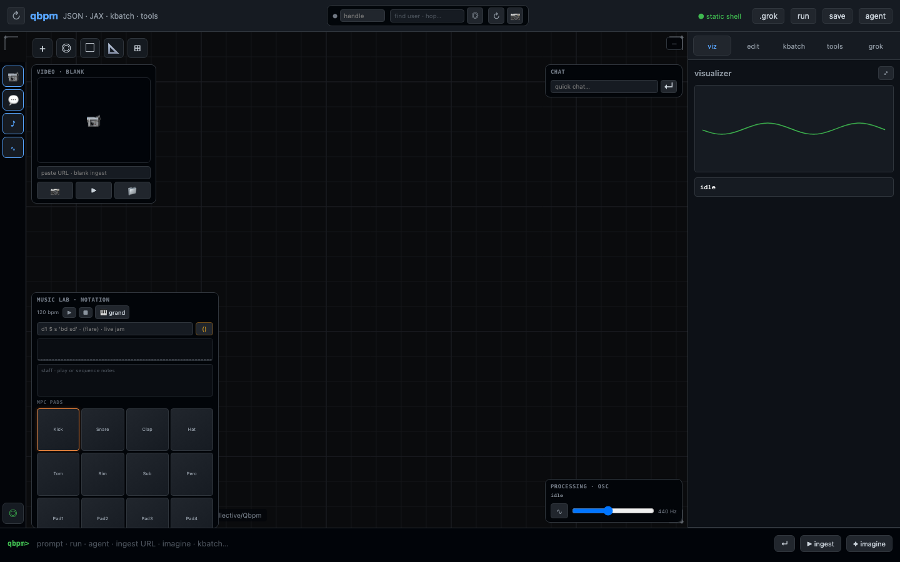 |

Canvas toolbar (`+`, `◎`, frames) sits **right of** the dock rail — not over it.

### Right panel tabs

| Visualizer | Inspector | kbatch |
|---|---|---|
| 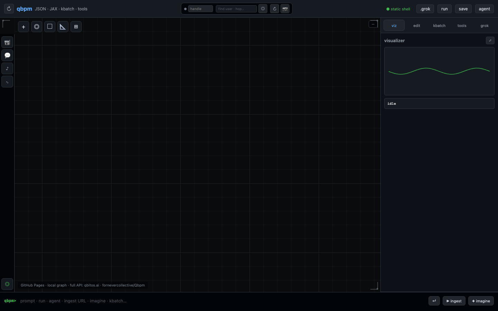 | 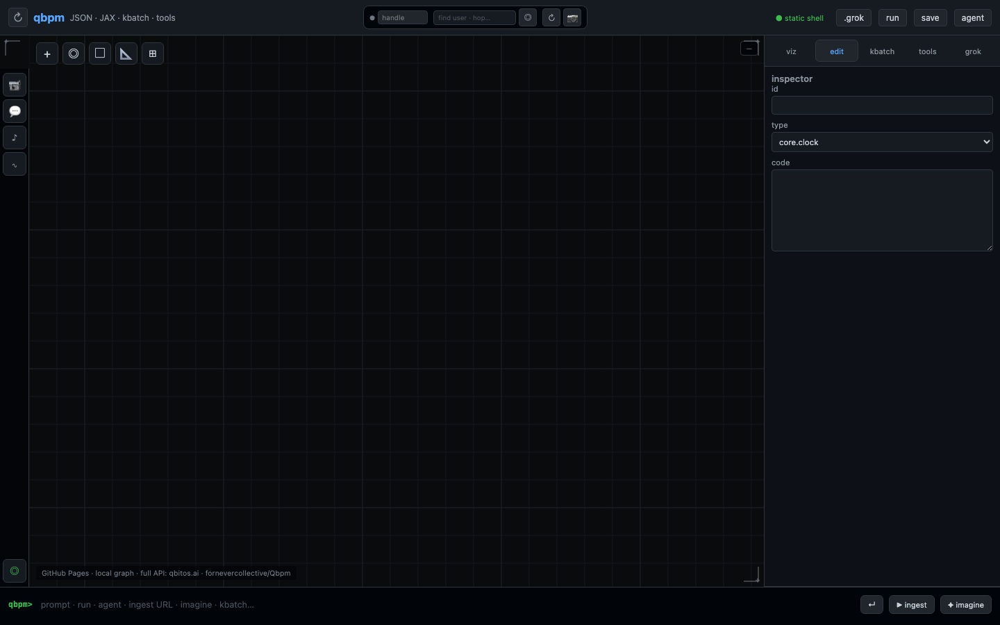 | 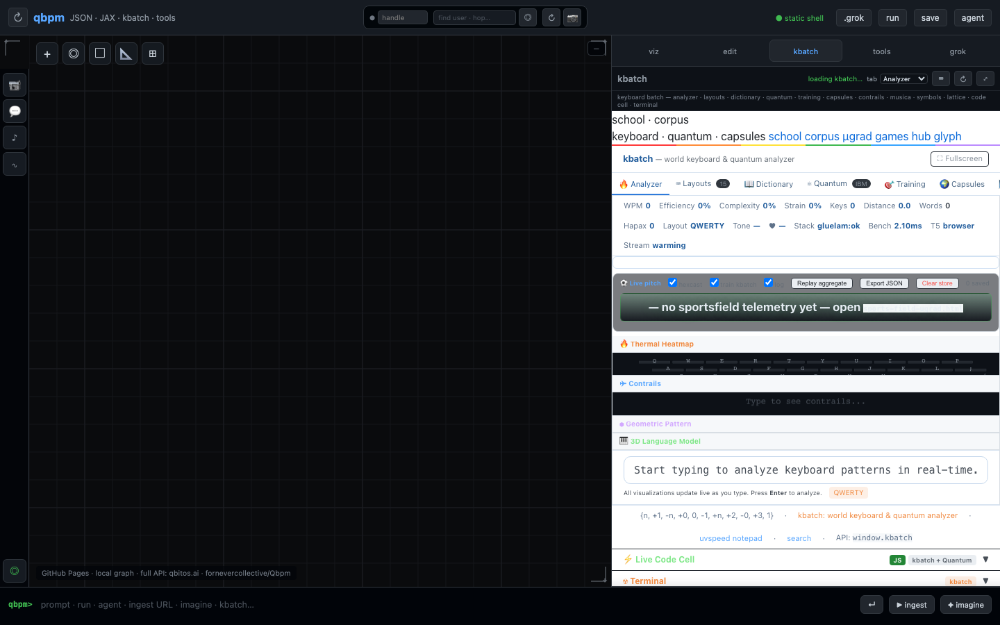 |

| Tools hub | .grok terminal |
|---|---|
| 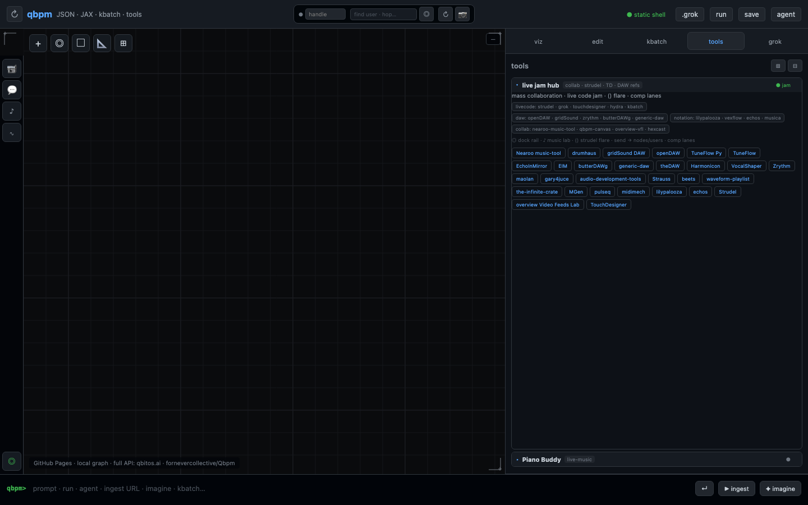 | 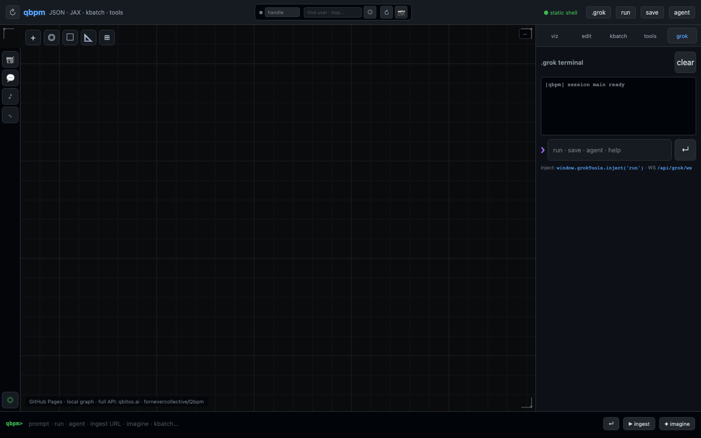 |

### Float dock panels

| Video | Chat | Music lab | Processing · osc |
|---|---|---|---|
| 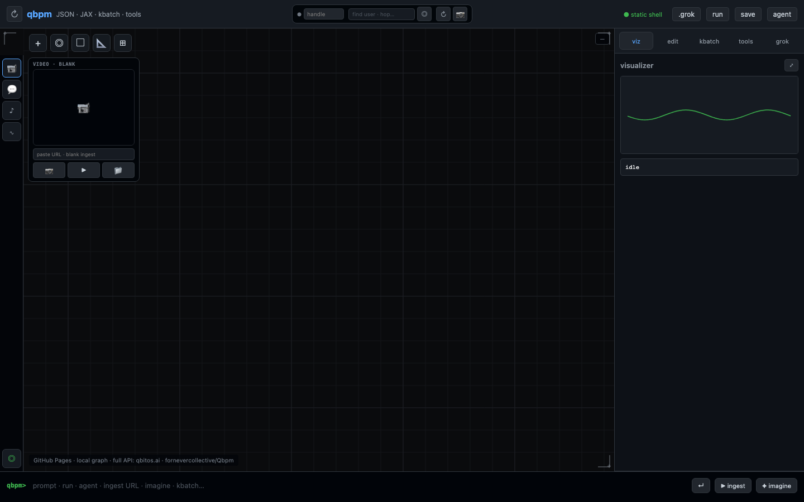 | 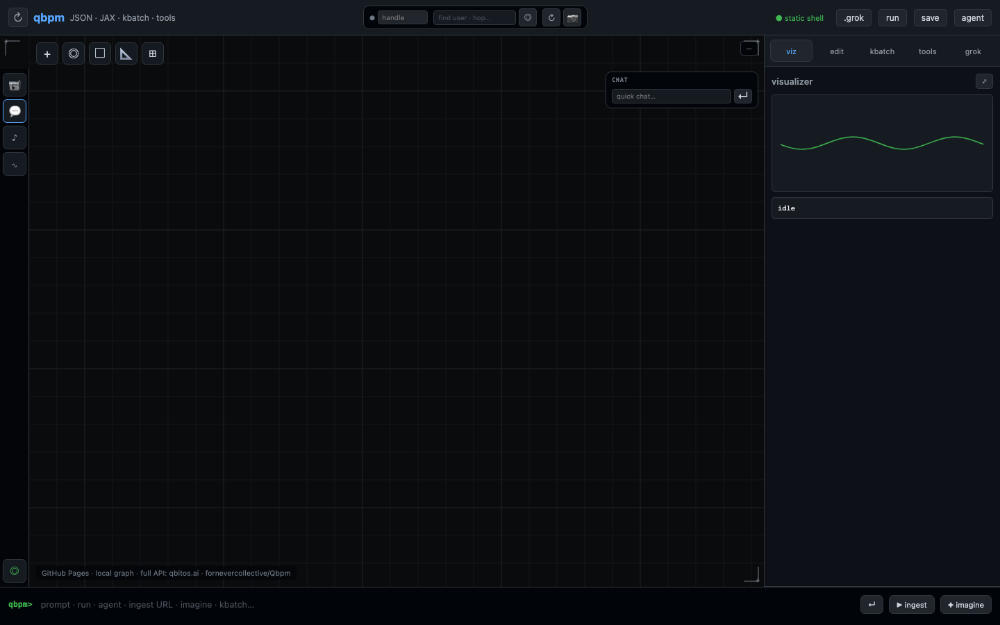 | 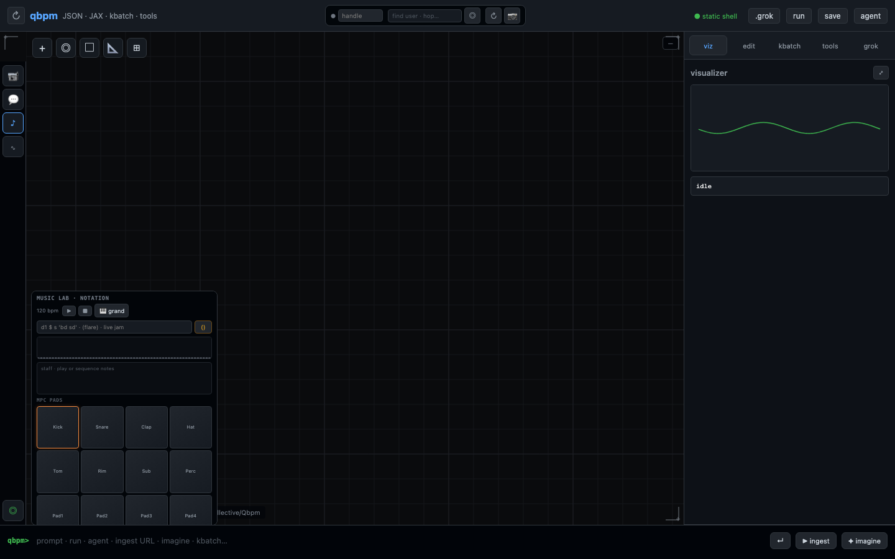 | 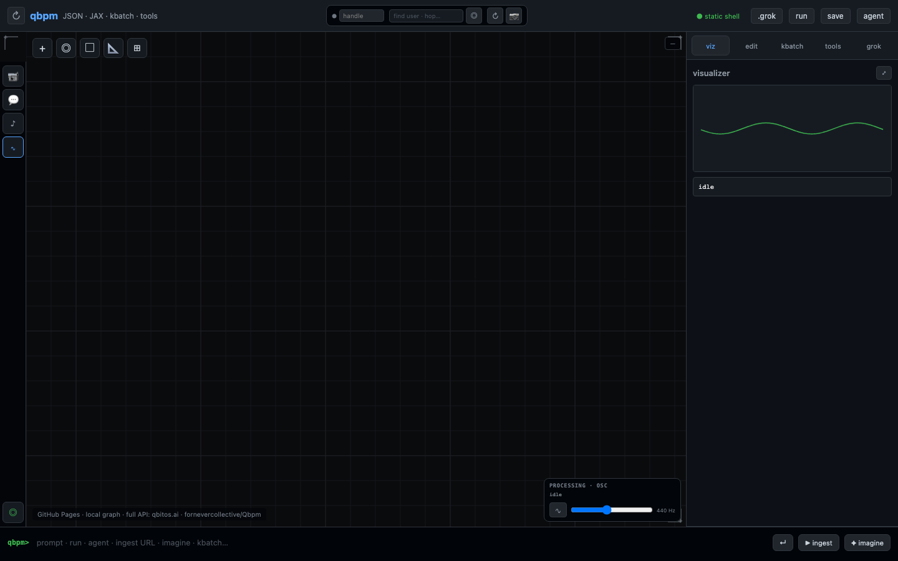 |

Regenerate: `./start.sh` then `node scripts/capture-readme-screenshots.mjs`

## go-ugrad HUD

Canvas overlay (like [go-ugrad](https://mueee.qbitos.ai/go-ugrad.html)):

- Crosshairs + dashed targeting lines to peers
- Target cards: **video left**, name + coords right (local cursor + remote peers)
- **Top-right:** chat notification toasts
- **Bottom-left:** live music notation mini-strip
- **Bottom-right:** processing readout (flow, run trace, frames, peers)

## Deploy

| Variant | Host | Build | API |
|---|---|---|---|
| **desktop** | `127.0.0.1:8796` | `./start.sh` | same origin |
| **pages** | `qbitos.github.io/qbpm/` | `VARIANT=pages make pages` | bridge → `api.qbitos.ai` |
| **forge** | `fornevercollective.github.io/Qbpm/` | `VARIANT=forge make forge` | bridge → `api.qbitos.ai` |
| **cloudflare** | `qbpm.qbitos.ai` | `VARIANT=cloudflare make cf` | bridge → `api.qbitos.ai` |
| **cloud** | `qbitos.ai` | `./start.sh` + nginx | same origin |

Variant configs: `deploy/variants/*.env` · launch components: `web/launch-config.json` · runtime: `web/pages-boot.js` reads baked `static/env-config.json`.

### One-time: enable GitHub Pages

In **qbitOS/qbpm → Settings → Pages**:

- **Source:** Deploy from a branch
- **Branch:** `gh-pages` / `/ (root)`

Workflow pushes `_site` to `gh-pages` on every `main` push.

### Auto-deploy (GitHub Actions on `main`)

| Workflow | Target |
|---|---|
| `deploy-pages.yml` | qbitOS Pages → **https://qbitos.github.io/qbpm/** (`gh-pages` branch) |
| `sync-fornevercollective.yml` | mirrors `web/` → **fornevercollective/Qbpm** (needs `FORNEVER_DEPLOY_TOKEN`) |
| `deploy-cloudflare-pages.yml` | **https://qbpm.qbitos.ai** (needs `CLOUDFLARE_API_TOKEN`, `CLOUDFLARE_ACCOUNT_ID`) |
| `ci.yml` | pytest + static builds for all variants |

### Cloudflare setup

1. Create Pages project `qbpm` · custom domain `qbpm.qbitos.ai`
2. Add repo secrets: `CLOUDFLARE_API_TOKEN`, `CLOUDFLARE_ACCOUNT_ID`
3. Push `main` — workflow builds `VARIANT=cloudflare` and deploys `_site`
4. `deploy/cloudflare/_redirects` + `_headers` ship with the build

### Forge / Cursor sync

```bash
make sync-forge   # local · uses Qbpm/ clone
```

CI uses `FORNEVER_DEPLOY_TOKEN` (PAT with `contents:write` on `fornevercollective/Qbpm`).

### Full stack API (qbitos.ai)

```bash
./start.sh   # port 8796
```

Reverse-proxy with `deploy/nginx-qbitos.conf.example` — API at `api.qbitos.ai` or path `/api` on `qbitos.ai`. CORS allows Pages, forge, and `qbpm.qbitos.ai` origins.

## Mobile & PWA

- Responsive layout with bottom panels (graph / viz / edit / grok tabs)
- Pinch zoom · **✥** pan mode button · 44px touch targets
- `manifest.webmanifest` + `sw.js` — offline shell caching
- Safe-area padding for notched devices

## Grok terminal injection

| Endpoint | Purpose |
|---|---|
| `POST /api/grok/inject` | Direct line injection (`{"text":"run"}`) |
| `POST /api/grok/inject/batch` | Multiple commands |
| `GET /api/grok/terminal` | Read terminal buffer |
| `WS /api/grok/ws` | Railway-compatible live inject |

Browser bridge:

```javascript
await grokTools.inject("run\n");
await grokTools.agent();
grokTools.connect(); // WebSocket
```

Commands: `help` · `run` · `save` · `graph` · `agent` · `set code <id> <py>` · `align node|graph`

## Live music coding (JAX / Python / JSON / Repel / WASM)

| Endpoint | Purpose |
|---|---|
| `POST /api/live/ingest` | kbatch / piano / browser live payload |
| `GET /api/live/state` | Latest flow, musica, bpm snapshot |
| `WS /api/live/ws` | Live fan-out to qbpm UI + tools |
| `GET /api/tools` | Discover `tools/kbatch` etc. |
| `/tools/kbatch/kbatch.html` | Embedded kbatch (same-origin) |

Starter graph: `graphs/live-music.json` — `music.clock` → `tool.kbatch` → `music.score` → `python.jax` / `wasm.classify` → `repel.play`.

```bash
# qbpm app (8796) — embeds kbatch
./start.sh

# kbatch standalone (8795) — forwards ingest to qbpm via CORS
cd tools/kbatch && ./start.sh
```

Browser bridge: `window.qbpmLive.ingest({ text, flow, musica, bpm })`

## Node types

- `core.clock` — tick / cpm
- `music.clock` — live tempo (cpm / bpm)
- `music.score` — flow + musica → notes from live bus
- `tool.kbatch` — keyboard live ingest snapshot
- `wasm.classify` — prefix_engine WASM lane (browser)
- `repel.play` — stream play hint (`~/dev/ffmpeg/repel`)
- `python.exec` — Python snippet (`result = ...`)
- `python.jax` — JAX snippet (`uv sync --extra jax`)
- `kernel.cuda` — CUDA binding stub
- `agent.mutator` — JSON diff proposals via `/api/agent/propose`
- `core.output` — sink

## CUDA build (optional)

```bash
nvcc -std=c++17 -arch=sm_80 -c src/kernels/attention_kernel.cu -o build/attention_kernel.o
```

## License

Apache-2.0